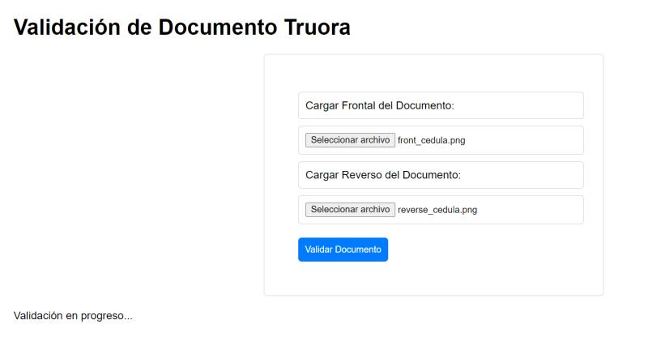

# 📝 Validación de Documentos Truora

Este proyecto es una aplicación sencilla que te permite validar documentos utilizando la API de Truora. Vamos a ponerlo en marcha. 

## 📂 Estructura del Proyecto

El proyecto consta de los siguientes archivos:

- `index.html`: Aquí es donde vive la interfaz de usuario de la aplicación.
- `styles.css`: Este archivo contiene todos los estilos que hacen que nuestra aplicación se vea bien.
- `script.js`: Este archivo es el cerebro de nuestra aplicación. Aquí es donde interactuamos con la API de Truora.
- `.env`: Este archivo contiene las variables de entorno necesarias para la aplicación, como la clave de la API de Truora y el endpoint de la API.
- `.gitignore`: Este archivo le dice a Git qué archivos o directorios no debe rastrear ni subir a tu repositorio.

## Cómo ejecutar el proyecto

Para poner en marcha este proyecto en tu máquina local, sigue estos sencillos pasos:

1. Clona el repositorio en tu máquina local. 📦
2. Navega hasta el directorio del proyecto en tu terminal. 🚀
3. Ejecuta `npm install` para instalar todas las dependencias necesarias. 🧰
4. Asegúrate de que tu archivo `.env` esté configurado con tus propias variables de entorno. 🔑 Necesitarás obtener una clave de API y un end-point de la API de Truora. ¡Mantén estas credenciales seguras!
5. Una vez que hayas reemplazado las credenciales en tu archivo `script.js`, simplemente abre `index.html` en tu navegador para probar la aplicación y validar tu documento. 🎉

